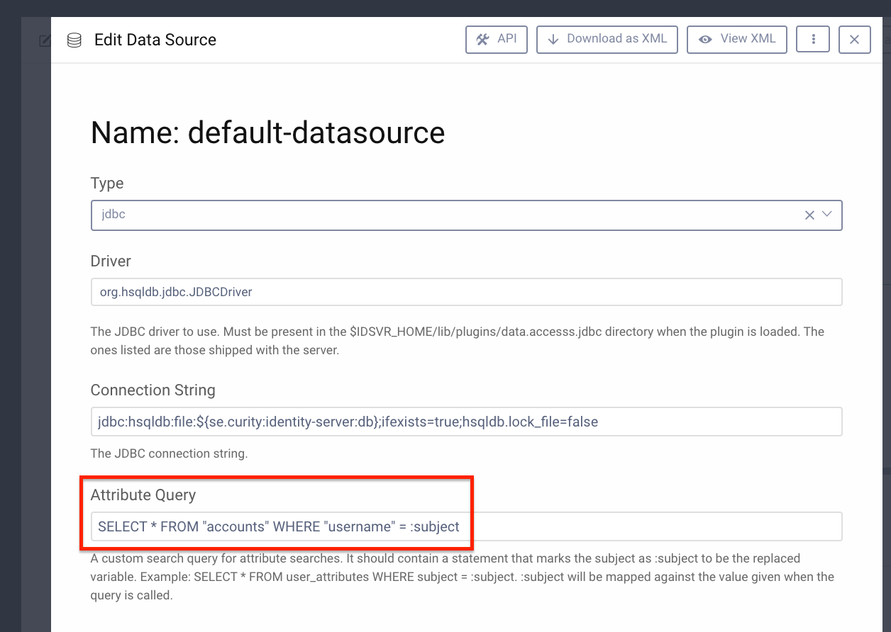
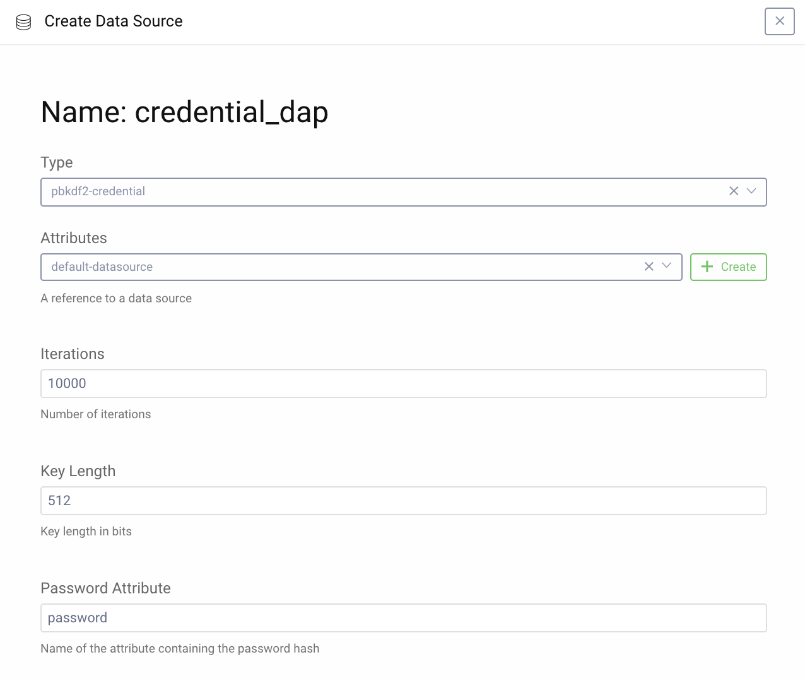
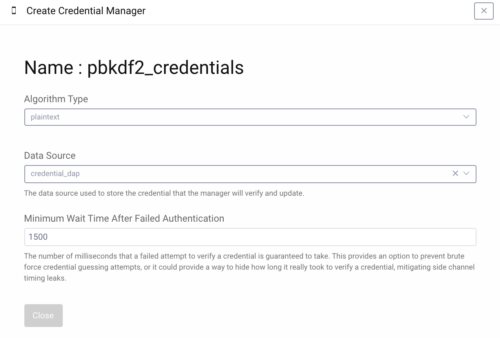

PBKDF2 Credential Data Access Provider Plugin
=============================================

.. image:: https://img.shields.io/badge/quality-experiment-red
    :target: https://curity.io/resources/code-examples/status/

.. image:: https://img.shields.io/badge/availability-source-blue
    :target: https://curity.io/resources/code-examples/status/

This repository contains an open-source Data Access Provider (DAP) plugin for the Curity Identity Server. This DAP does not have all features of a regular DAP but serves to validate credentials which have been hashed with the PBKDF2 algorithm.

The idea of this DAP is that it should be in between another DAP which can fetch the password hash as an attribute and a credential manager which is configured to use handle ``plaintext``, thus leaving the validation to this plugin.

Building the Plugin
~~~~~~~~~~~~~~~~~~~

You can build the plugin by issue the command ``gradle build``. This will produce a JAR file in the ``build/libs`` directory, which can be installed.

Installing the Plugin
~~~~~~~~~~~~~~~~~~~~~

To install the plugin, copy the compiled JAR into the ``${IDSVR_HOME}/usr/share/plugins/${pluginGroup}`` on each node, including the admin node. For more information about installing plugins, refer to the plugins `documentation <https://developer.curity.io/docs/latest/developer-guide/plugins/index.html#plugin-installation/>`_.

Configuration
~~~~~~~~~~~~~

First configure a data source to be able to fetch the attribute which contains the password hash. All other attributes fetched which is not the password hash will be added to the subject attributes. This could be any type of data source. In the example below we use a JDBC.



Next up is to create a new DAP with the type ``pbkdf2-credential``. Select your first data source as attribute source, which algorithm parameters to use and which attribute that contains the hash. 



Last thing is to configure a ``Credential Manager`` to use your credential DAP. Either modify a current one or create a new one which should use the ``plaintext`` algorithm and the credential dap as Data source.



You can then use this Credential Manager in for example your Authenticators.

Limitations
~~~~~~~~~~~

Since the plugin relies on attributes from another DAP it cannot update the password using that DAP. Password update will have to be implemented to talk to the actual data source directly.

The plugin assumes that the hash is stored in this format:

``<Base64(salt)>:<Base64(hash)>``

An example would be

``EHuGEOTebG0donCRunK3AelIkLvKlpJohXpeFKYJYqP80HPE/PaBuf+VvF5HbRU5A3rbOLMLaBVacRkli6l7MQ==:3pyfz3Mq4WOvv350xSVWnK8g6NBuWrN115DAUJ6OwPtx9p5mLVzu7SWhHWcEa816m0q7ymFcW5fRyd9s3pIIsA==```

Which represents first the salt and then the hash from the password "``1234``" with ``SHA1``, ``10000`` iterations and ``512`` bits of key length.

If you have configured your data source to return all attributes (including password hash) keep in mind that if use the attribute data source again, e.g. for a claims provider, you will get the hash there as well. The subject attributes will however have all attributes but the hash.

Contributing
~~~~~~~~~~~~

Pull requests are welcome. To do so, just fork this repo, and submit a pull request.

License
~~~~~~~

The files and resources maintained in this repository are licensed under the `Apache 2 license <LICENSE>`_.

More Information
~~~~~~~~~~~~~~~~

Please visit `curity.io <https://curity.io/>`_ for more information about the Curity Identity Server.

Copyright (C) 2021 Curity AB.
