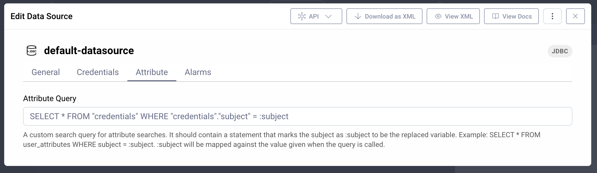
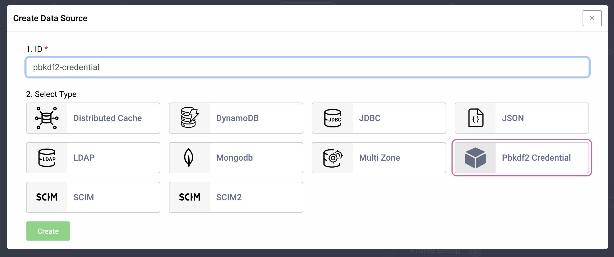
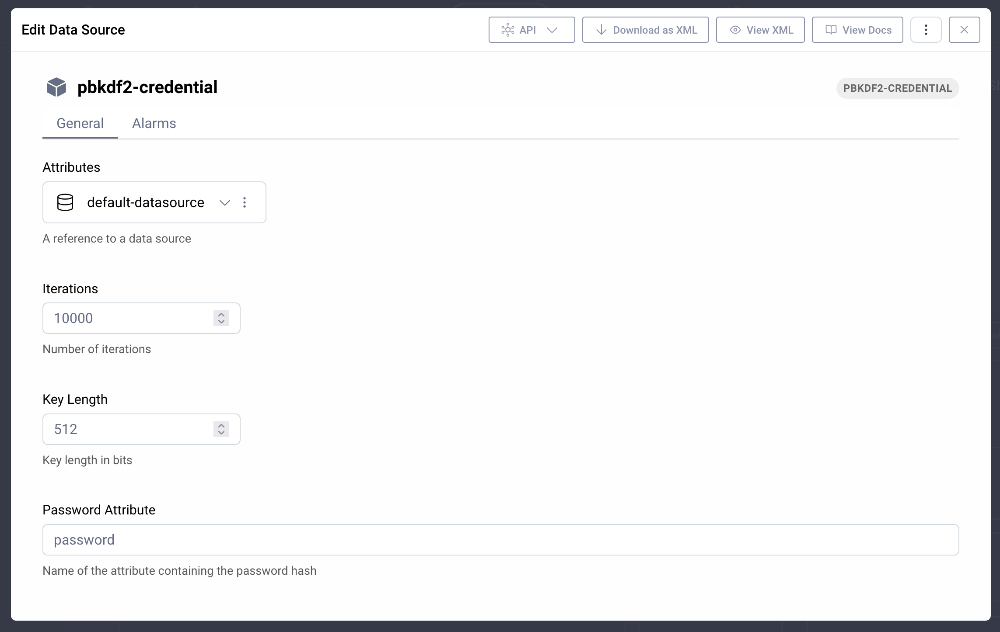
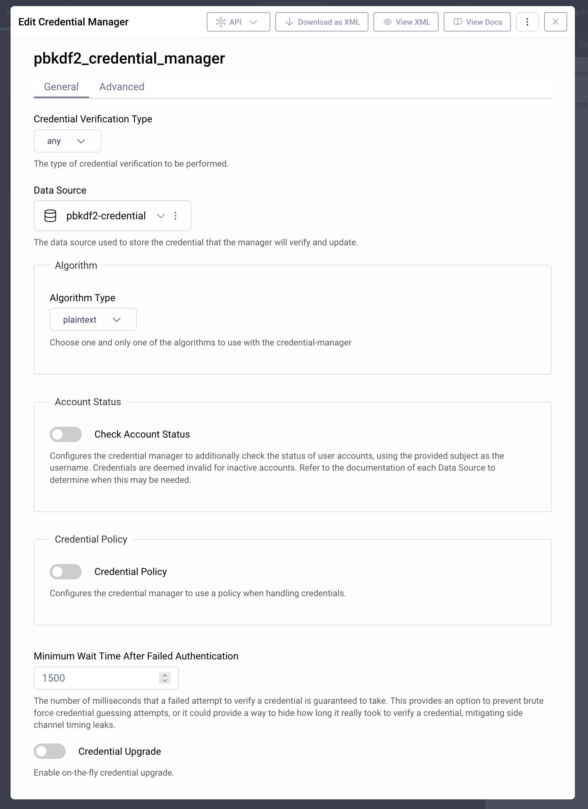

PBKDF2 Credential Data Access Provider Plugin
=============================================

.. image:: https://img.shields.io/badge/quality-demo-red
    :target: https://curity.io/resources/code-examples/status/

.. image:: https://img.shields.io/badge/availability-source-blue
    :target: https://curity.io/resources/code-examples/status/

This repository contains an open-source Data Access Provider (DAP) plugin for the Curity Identity Server. This DAP provides only one feature — it validates credentials which have been hashed with the PBKDF2 algorithm.

This DAP should be configured in addition to a full-featured DAP, that can fetch the hashed password from the database. Any credential managers that should work with this DAP should be configured to ``plaintext`` (see below), so that the validation is left to this plugin.

Building the Plugin
~~~~~~~~~~~~~~~~~~~

Build the plugin by running ``./gradlew build``. This will produce a JAR file in the ``build/libs`` directory, which can be installed.

Installing the Plugin
~~~~~~~~~~~~~~~~~~~~~

To install the plugin, copy the compiled JAR into ``${IDSVR_HOME}/usr/share/plugins/${pluginGroup}`` on each node, including the admin node. For more information about installing plugins, refer to the plugins `documentation <https://curity.io/docs/identity-server/developer-guide/plugins/index.html#plugin-installation>`_.

Configuration
~~~~~~~~~~~~~

First, configure a data source to fetch the attribute which contains the password hash. The demo assumes that the attribute will be held in the ``attributes`` field. For example, in the below configuration of a JDBC data source, the hashed password is kept in the ``attributes`` field of the ``credentials`` table. Thus the contents of the table is loaded as attributes made available to the plugin.

Next, create a new data source with the type ``Pbkdf2 Credential``. Select the previously configured data source as attribute source. Set the algorithm parameters and the name of the field in ``attributes`` that contains the password hash.

Then, configure a ``Credential Manager`` to use the new credential DAP (under **Facilities** -> **Credential Managers**). Either modify an existing manager or create a new one. The manager should use the ``plaintext`` algorithm and the credential dap as Data source.

Finally, use the Credential Manager with an component that needs to verify credentials. For example, you can use the Credential Manager in an `username and password authenticator<https://curity.io/resources/learn/username-password-authenticator/>`_.

Limitations
~~~~~~~~~~~

This demo plugin implements only the verification part of the Credentials Data Access Provider. It is not able to modify credentials. To do so, you would need to implement the `CredentialsStoringDataAccessProvider <https://curity.io/docs/idsvr-java-plugin-sdk/latest/se/curity/identityserver/sdk/datasource/CredentialStoringDataAccessProvider.html>`_ interface.

Data Format
~~~~~~~~~~~

The plugin assumes that the hash is stored in this format:

``<Base64(salt)>:<Base64(hash)>``

For example:

``EHuGEOTebG0donCRunK3AelIkLvKlpJohXpeFKYJYqP80HPE/PaBuf+VvF5HbRU5A3rbOLMLaBVacRkli6l7MQ==:3pyfz3Mq4WOvv350xSVWnK8g6NBuWrN115DAUJ6OwPtx9p5mLVzu7SWhHWcEa816m0q7ymFcW5fRyd9s3pIIsA==``

Which represents first the salt and then the hash from the password "``1234``" with ``SHA1``, ``10000`` iterations and ``512`` bits of key length.

If you have configured your data source to return all attributes (including password hash) keep in mind that if use the attribute data source again, e.g. for a claims provider, you will get the hash there as well.

Contributing
~~~~~~~~~~~~

Pull requests are welcome. To do so, just fork this repo, and submit a pull request.

License
~~~~~~~

The files and resources maintained in this repository are licensed under the `Apache 2 license <LICENSE>`_.

More Information
~~~~~~~~~~~~~~~~

Please visit `curity.io <https://curity.io/>`_ for more information about the Curity Identity Server.

Copyright (C) 2026 Curity AB.
